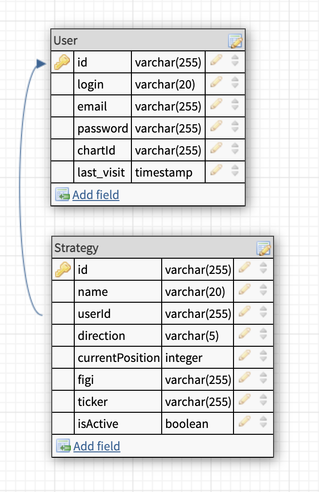
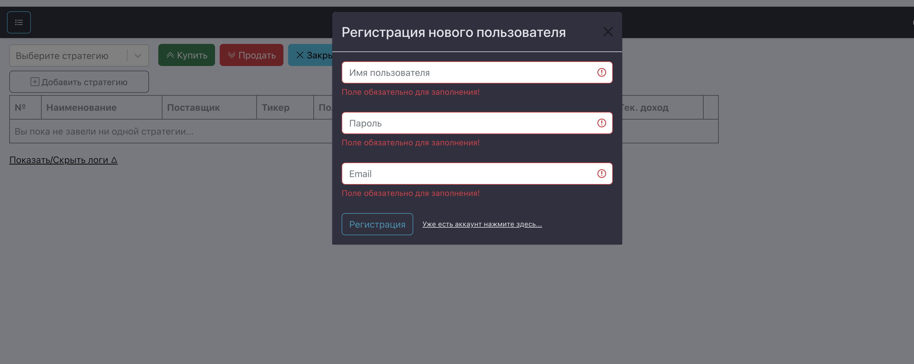

== Драфт проекта ParseSignal (web version)

Проект состоит из двух модулей. Бэковая часть написана на Java (SpringBoot). Фронтовая часть директория draft-ui (React, Redux, Typescript).
База данных на текущем этапе не используется. Вся информация записывается в кэш.

=== Схема БД
 

=== Локальный запуск и локальная разработка

. Клонируем проект командой git clone https://github.com/GavryushkinSI/Draft.git.
. Запускаем бэк командой ./gradlew bootRun (запуск команды из директории draft).
 Сервер стартанёт на 9000 порту по умолчанию. В консоли увидем Tomcat started on port(s): 9000 (http) with context path ''. Started DraftApplication in 4.703 seconds (JVM running for 5.192)
. Далее запускаем сборку фронта и поднимаем dev server на 3000 порту.
 Для этого переходим в директорию draft-ui. Выпролняем в консоли команду npm -i.
 После установки зависимостей выполняем команду npm start.
. Чтобы не было ошибки кроссдоменного взаимодейтсвия CORS POLICY запускаем браузер в отключенном режиме безопасности командой open -n -a /Applications/Google\ Chrome.app/Contents/MacOS/Google\ Chrome –args –user-data-dir="/tmp/chrome_dev_test" –disable-web-security (для google chrome).
. Переходим на адрес http://localhost:3000. Откроется стартовая страница приложения с формой авторизации.
 

=== Промышленная эксплуатация
На пром проект доставляется ввиде докер контейнера путём выкачки образа из репозитория docker hub.
Запуск выкачки образов и последующий запуск контейнеров осуществляется командой docker-compose up.
Команду запускать в директории расположения файла docker-compose.yml (см. файл docker-compose.yml).

=== Концепт проекта
Пользователь логиниться на сайте. Далее добавляет стратегию для тестирования. Непосредственно сигналы
сделок берутся с сайта TradingView. Для этого в качестве потребителя сигналов нужно прописать конечную точно http://{host}/api/tv.

